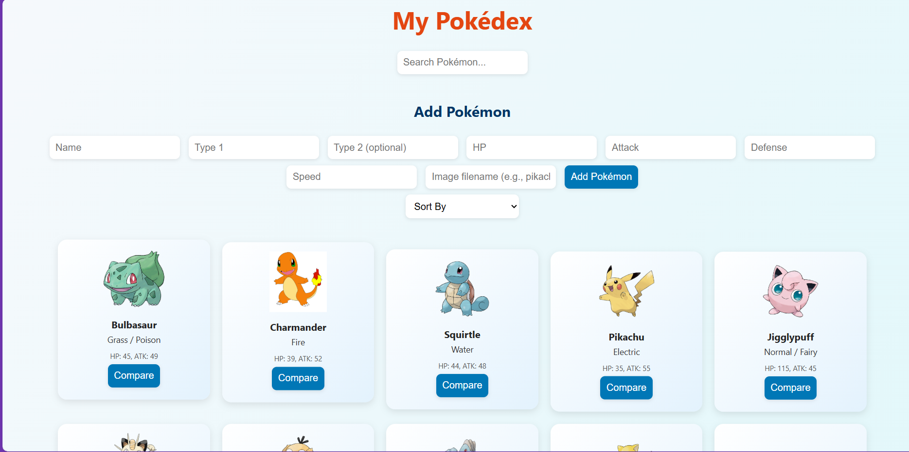
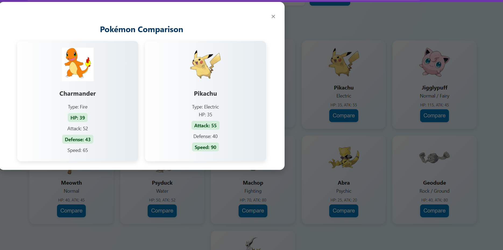

# Pokédex Web App

A full-stack Pokédex application built with HTML, CSS, JavaScript, Node.js, and MySQL. Users can browse, search, filter, sort, and compare Pokémon with an intuitive interface and smooth animations.

## Features

- Search Pokémon by name
- Filter by type
- Sort by name, ID, or type
- Compare two Pokémon side-by-side
- Admin interface to add new Pokémon
- Smooth animations using GSAP
- Pokémon data stored and retrieved from a MySQL database

## Tech Stack

| Frontend Technologies   | Backend Technologies | Database |
|--------------------------|----------------------|----------|
| HTML, CSS, JavaScript    | Node.js, Express.js  | MySQL    |
| GSAP (for animations)    |                      |          |

## Screenshots

### Homepage



### Compare Pokémon



## Getting Started

Follow these steps to run the project locally.

### 1. Clone the Repository

```bash
git clone https://github.com/Sainathashwatha/pokedex-web-app.git
cd pokedex-web-app
```
### 2. Install Dependencies
```bash

npm install
```
3. Configure the MySQL Database
-Open your MySQL client (e.g., MySQL Workbench, phpMyAdmin, or CLI)
-Create a new database named pokedex
-Run the following SQL commands:
```sql

CREATE DATABASE pokedex;

USE pokedex;

CREATE TABLE pokemon (
  id INT PRIMARY KEY AUTO_INCREMENT,
  name VARCHAR(255),
  type VARCHAR(100),
  image_url TEXT
);
```
-You can add initial data manually or insert test Pokémon entries.
-Update your database credentials in the db.js file:
```js

const connection = mysql.createConnection({
  host: 'localhost',
  user: 'your_mysql_username',
  password: 'your_mysql_password',
  database: 'pokedex'
});
```
4. Start the Backend Server
-Use nodemon or Node to start the server:
```bash
npm run dev
```
-Then open your browser and visit

 
 
